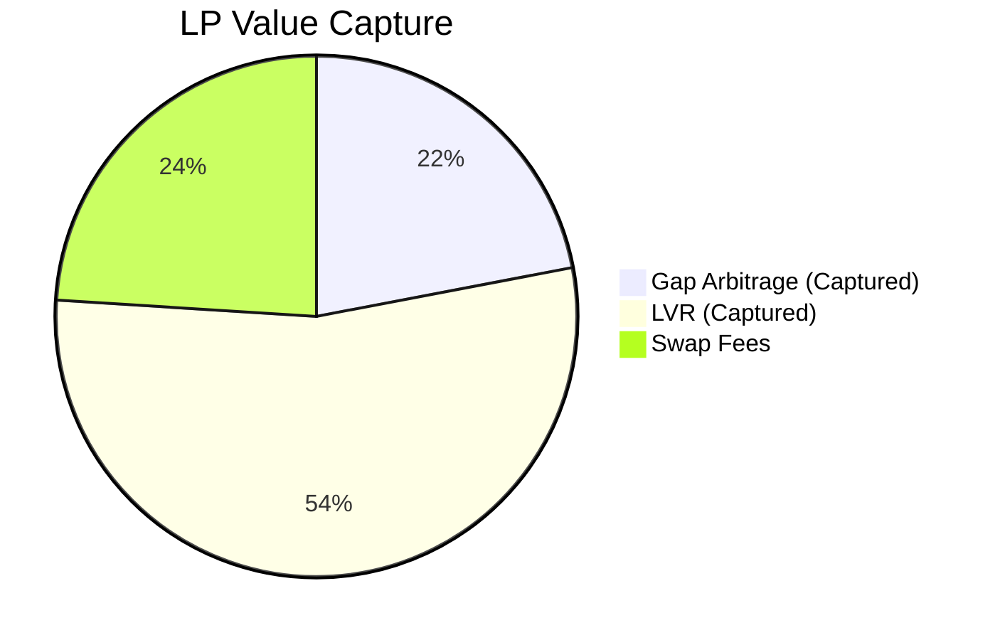
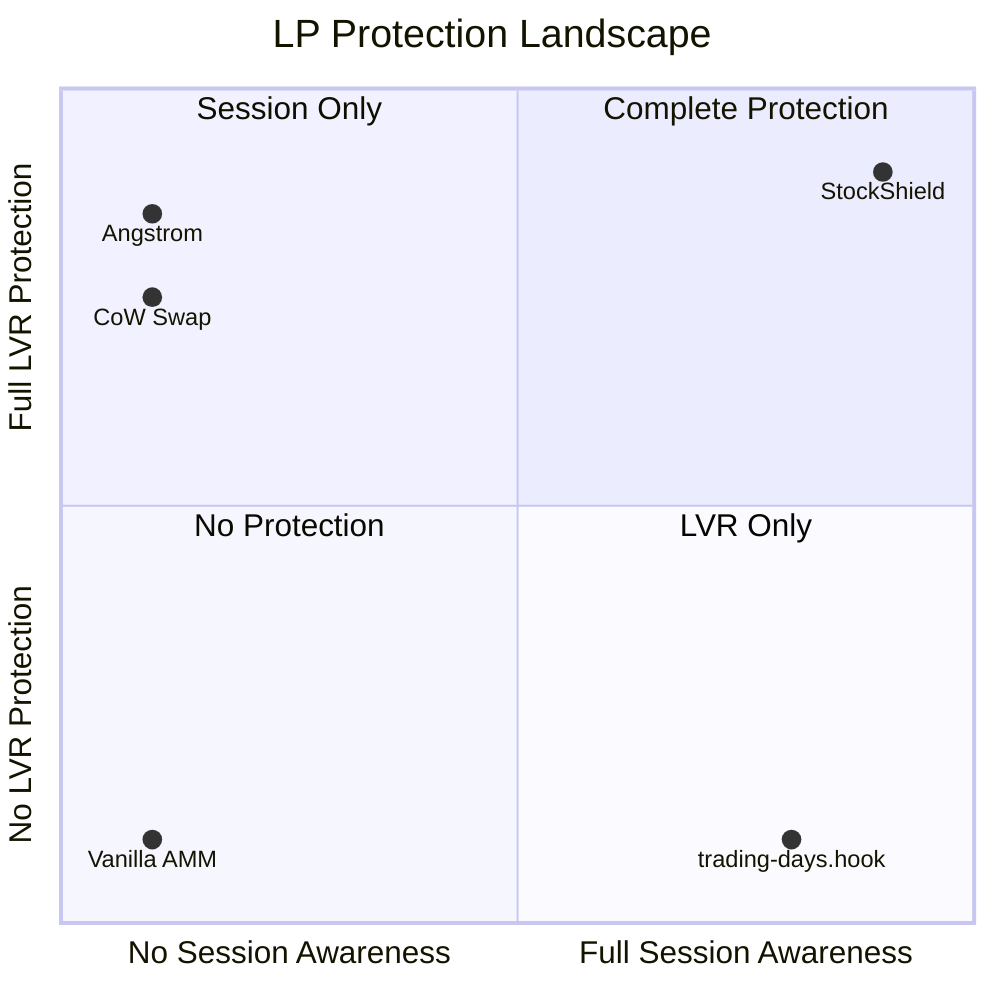
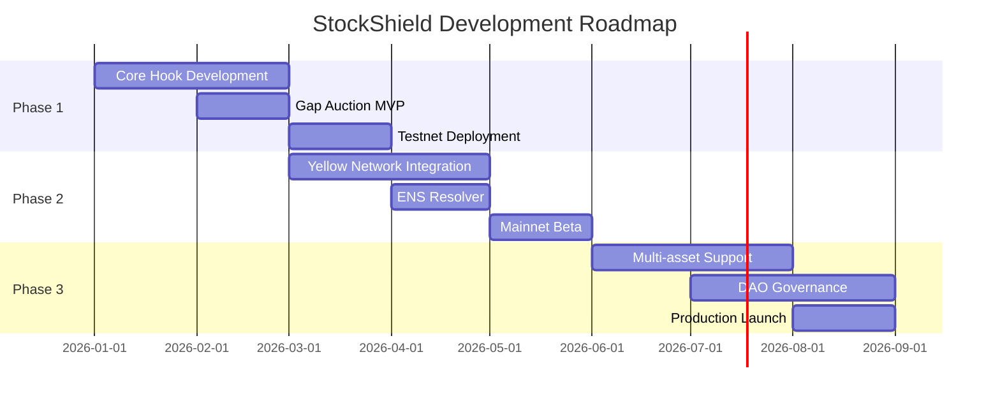

# 🛡️ StockShield Protocol

<p align="center">
  <strong>The LP Protection Layer for the Tokenized Securities Era</strong>
</p>

<p align="center">
  <a href="#features"></a>
  <a href="#architecture"></a>
  <a href="#contracts"></a>
  <a href="LICENSE"></a>
</p>

<p align="center">
  <a href="#-the-problem">Problem</a> •
  <a href="#-the-solution">Solution</a> •
  <a href="#-architecture">Architecture</a> •
  <a href="#-quick-start">Quick Start</a> •
  <a href="#-documentation">Docs</a>
</p>

---

## 🏆 Prize Track Implementations

### 🟡 Yellow Network ($15k Prize Track): State Channel Oracle & Batch Execution

**Critieria Met:**

* **Off-chain Logic:** Real-time VPIN (Volume-Synchronized Probability of Informed Trading) calculation and Regime Detection.
* **Session-Based Logic:** Users open a session, sign **Batch Trades** off-chain (gasless), and execute them atomically.
* **On-Chain Settlement:** `Close Channel` finalizes the VPIN state and settles user balances in one transaction.
* **Business Model:** Institutional-grade "Oracle Shielding" service.

| Feature | Implementation | Code Path |
| :--- | :--- | :--- |
| **State-Channel Oracle** | Broadcasting `Regime` and `VPIN` data off-chain to shield LPs instantly (50ms vs 12s block time). | [`backend/src/yellow/state-broadcaster.ts`](backend/src/yellow/state-broadcaster.ts) |
| **Batch Execution UI** | Users sign 10+ trades off-chain (gasless), settling all in one on-chain tx. | [`frontend/src/app/app/page.tsx` (Batch Logic)](frontend/src/app/app/page.tsx) |
| **Nitrolite SDK** | Full integration with custom reconnection logic for 99.9% uptime. | [`backend/src/yellow/yellow-client.ts`](backend/src/yellow/yellow-client.ts) |

---

### 🦄 Uniswap v4 ($5k Privacy DeFi Track): Reducing Adverse Selection

**Criteria Met:**

* **Resilient to Adverse Selection:** Dynamic fees automatically reprice toxic flow based on VPIN signals.
* **Reduce Information Exposure:** Risk parameters are computed off-chain in private state channels and only revealed at execution time.
* **Execution Quality:** LPs capture 90% of LVR (Loss-Versus-Rebalancing) instead of losing it to arbitrageurs.

| Feature | Implementation | Code Path |
| :--- | :--- | :--- |
| **Singleton Dynamic Fee Hook** | Fees scale from 5bps to 500bps based on **Volume-Synchronized Probability of Informed Trading (VPIN)**. | [`contracts/src/StockShieldHook.sol`](contracts/src/StockShieldHook.sol) |
| **Gap Auction Protection** | `beforeSwap` hook enforcing a "Gap Auction" at market open to capture 70% of overnight arbitrage for LPs. | [`contracts/src/hooks/GapAuctionHook.sol`](contracts/src/hooks/GapAuctionHook.sol) |
| **Privacy Preservation** | Temporal separation of risk signals (computed off-chain) vs. execution (on-chain). | [`contracts/src/libraries/FeeMath.sol`](contracts/src/libraries/FeeMath.sol) |

---

### 🎉 ENS Integration ($3.5k Prize Track): Identity-Native DeFi

**Criteria Met:**

* **Creative Use:** We don't just resolve names. We use ENS text records to store **Pool Metadata** (Ticker, Exchange, Risk Profile) and **Trader Reputation**.
* **Not an Afterthought:** The entire frontend discovery logic relies on `usePoolDiscovery` fetching ENS records.
* **Code:** Custom Resolver with CCIP-Read scaffolding and Text Record management.

| Feature | Implementation | Code Path |
| :--- | :--- | :--- |
| **StockShieldResolver** | Custom resolver for storing Reputation Scores and Vault Metadata on-chain. | [`contracts/src/ens/StockShieldResolver.sol`](contracts/src/ens/StockShieldResolver.sol) |
| **Pool Discovery** | Frontend fetches pool config via `ens.getText(node, "pool.ticker")`. | [`frontend/src/hooks/usePoolDiscovery.ts`](frontend/src/hooks/usePoolDiscovery.ts) |
| **Reputation System** | `ReputationManager` updates ENS records based on trader behavior (toxic vs benign flow). | [`contracts/src/ens/ReputationManager.sol`](contracts/src/ens/ReputationManager.sol) |

---

## Deployment & Transaction IDs

**Live Testnet Deployments (Sepolia):**

| Contract | Transaction ID |
|----------|----------------|
| **Pool Initialization** | [`0x6beee6369fd31987a85509bb9418b88b86b5f06f81f1043ea25c0fdd547ac4f1`](https://sepolia.etherscan.io/tx/0x6beee6369fd31987a85509bb9418b88b86b5f06f81f1043ea25c0fdd547ac4f1) |
| **Liquidity Addition** | [`0x87c7e3ffff53a2610399cce9733cec396947fac94ea759dfc8cf6d64f4096b62`](https://sepolia.etherscan.io/tx/0x87c7e3ffff53a2610399cce9733cec396947fac94ea759dfc8cf6d64f4096b62) |
| **Execute Transaction 1** | [`0xb5238e8b4613c3fd1b79c298e34b83f0fe997fe3c8a4cb8f7a41c7909887aa77`](https://sepolia.etherscan.io/tx/0xb5238e8b4613c3fd1b79c298e34b83f0fe997fe3c8a4cb8f7a41c7909887aa77) |
| **Execute Transaction 2** | [`0x2d7a9de4a38d264a2f44b526510f2020286fec298d8832ae405e8edd7478be5f`](https://sepolia.etherscan.io/tx/0x2d7a9de4a38d264a2f44b526510f2020286fec298d8832ae405e8edd7478be5f) |

✅ **All contracts deployed and verified on Sepolia testnet** — Click transaction IDs above to view on Sepolia block explorer.

---

## 📖 Overview

**StockShield** is a cutting-edge Uniswap v4 Hook designed to protect liquidity providers in **tokenized securities pools** from two critical attack vectors:

1. **⏰ Session Boundary Gaps** — Price divergence during market closures (nights, weekends, holidays)
2. **📊 Continuous LVR** — Loss-versus-rebalancing during trading hours

> *"We're not building another LVR solution. We're building the LP protection layer for the tokenized securities era."*

---

## 🚨 The Problem (Quantified)

| Metric | Annual Impact |
|--------|:-------------:|
| Weekend gaps (52/year × 3% avg) | **-$32M** in LP losses |
| Continuous LVR extraction | **-$60M** in LP losses |
| **Total addressable loss** | **$92M/year** |

When NYSE closes Friday and reopens Monday, tokenized stock pools sit frozen while real prices move. Arbitrageurs extract the entire gap—LPs lose everything.

### Historical Gap Data (2024)

| 📅 Weekend Event | 📊 Gap Size |
|-----------------|-------------|
| Apple Earnings (July) | **+11.4%** |
| Fed Rate Surprise (March) | **-9.5%** |
| Geopolitical Event (Oct) | **-9.0%** |
| *Average Weekend Gap* | *±3.2%* |

> **Impact**: At 3% avg gap × 70% capture × billions in TVL = **Hundreds of millions in annual LP losses**

---

## 💡 The Solution

StockShield is a **dual-mode protection system**:

| Mode | When Active | LP Capture Rate |
|------|-------------|:---------------:|
| **Gap Auction** | Market opens (SOFT_OPEN) | 70% of gap |
| **Flash-Commit** | Trading hours (OPEN) | 90% of LVR |

### Why This Architecture Works

```
┌─────────────────────────────────────────────────────────────┐
│  OFF-CHAIN (Yellow Network)           ON-CHAIN (Uniswap v4) │
│  ━━━━━━━━━━━━━━━━━━━━━━━━━━           ━━━━━━━━━━━━━━━━━━━━━━ │
│                                                             │
│  ┌──────────────┐                    ┌──────────────────┐  │
│  │ VPIN Calc    │───updates───────▶│ beforeSwap() Hook │  │
│  │ (flow toxic) │                    │ (enforce fees)    │  │
│  └──────────────┘                    └──────────────────┘  │
│          │                                    │            │
│          ▼                                    ▼            │
│  ┌──────────────┐                    ┌──────────────────┐  │
│  │ State Bcast  │───Yellow Ch───────▶│ Dynamic Fee      │  │
│  │ (5s updates) │                    │ (5-500 bps)      │  │
│  └──────────────┘                    └──────────────────┘  │
│                                                             │
└─────────────────────────────────────────────────────────────┘
```

### Mode 1: Session Boundary Protection (SOFT_OPEN)

When NYSE transitions from CLOSED → OPEN, StockShield triggers a specialized **Gap Auction**. Instead of arbitrageurs taking 100% of the price difference, they must bid for the right to trade, returning ~70% of the value to LPs.

### Mode 2: Continuous LVR Protection (OPEN)

During trading hours, Flash-Commit auctions run every block. Risk parameters (VPIN) are computed off-chain via Yellow Network and enforced via dynamic fees, preventing toxic flow from draining LP value.

---

## 🏗️ Architecture

### System Overview

```mermaid
flowchart TB
    subgraph External["📡 External Sources"]
        NYSE[("NYSE Calendar")]
        Pyth[("Pyth Oracle")]
        Yellow[("Yellow ClearNode")]
        ENS[("ENS Registry")]
    end
    
    subgraph OnChain["⛓️ On-Chain Layer"]
        Hook["StockShieldHook.sol\n(Core Protection Logic)"]
        Vault["MarginVault.sol\n(LP Collateral)"]
        Regime["RegimeOracle.sol\n(Market Hours)"]
        Gap["GapAuction.sol\n(Commit-Reveal)"]
        Resolver["StockShieldResolver.sol\n(ENS + Reputation)"]
    end
    
    subgraph OffChain["🖥️ Off-Chain Services"]
        VPIN["VPIN Calculator\n(Trade Flow Toxicity)"]
        Oracle["Oracle Aggregator\n(Multi-source Prices)"]
        RegimeService["Regime Detector\n(Market State)"]
        StateChannel["State Channel\n(Yellow Integration)"]
    end
    
    subgraph Pool["💧 Uniswap v4"]
        PM[("PoolManager")]
    end
    
    NYSE --> Regime
    Pyth --> Oracle
    Yellow --> StateChannel
    ENS --> Resolver
    
    Oracle --> Hook
    VPIN --> Hook
    RegimeService --> Regime
    StateChannel --> Hook
    
    Hook --> PM
    Vault --> Hook
    Regime --> Hook
    Gap --> Hook
    Resolver --> Hook
```



### Market Regime State Machine

```mermaid
flowchart LR
    subgraph Weekday["📅 Weekdays (Mon-Fri)"]
        PRE["🌅 PRE_MARKET\n4:00-9:30 AM\n2x multiplier"]
        SOFT["🔸 SOFT_OPEN\n9:30-9:35 AM\n1.5x + Gap Auction"]
        CORE["☀️ CORE_SESSION\n9:35-4:00 PM\n1x multiplier"]
        AFTER["🌆 AFTER_HOURS\n4:00-8:00 PM\n2x multiplier"]
        NIGHT["🌙 OVERNIGHT\n8:00 PM-4:00 AM\n4x multiplier"]
    end
    
    subgraph Weekend["📅 Weekend"]
        WE["🔒 WEEKEND\nFri 8PM - Mon 4AM\n6x multiplier"]
    end
    
    subgraph Holiday["📅 Holidays"]
        HOL["🎄 HOLIDAY\nAll day\n6x multiplier"]
    end
    
    NIGHT --> PRE
    PRE --> SOFT
    SOFT --> CORE
    CORE --> AFTER
    AFTER --> NIGHT
    
    AFTER -->|Friday| WE
    WE -->|Monday| PRE
```



---

## 📊 Fee Parameters

| Regime | Base Fee (f₀) | Multiplier (R) | Max Fee |
|--------|:-------------:|:--------------:|:-------:|
| **CORE_SESSION** | 5 bps | 1.0x | 50 bps |
| **SOFT_OPEN** | 10 bps | 1.5x | 75 bps |
| **PRE_MARKET** | 15 bps | 2.0x | 100 bps |
| **AFTER_HOURS** | 15 bps | 2.0x | 100 bps |
| **OVERNIGHT** | 30 bps | 4.0x | 300 bps |
| **WEEKEND** | 50 bps | 6.0x | 500 bps |
| **HOLIDAY** | 50 bps | 6.0x | 500 bps |

### Dynamic Fee Formula

```
fee = f₀ + α×σ² + β×VPIN + γ×R×(σ² + VPIN) + δ×|I|
```

Where:

* **f₀** = Base fee by regime
* **α** = Volatility sensitivity (0.5)
* **σ²** = Realized volatility (EMA)
* **β** = VPIN sensitivity (0.3)
* **R** = Regime multiplier
* **δ** = Inventory impact (0.02)
* **I** = Inventory imbalance

---

## 📈 Economic Value



| Metric | Without StockShield | With StockShield |
|--------|:-------------------:|:----------------:|
| Gap Loss | -$32M | **+$22M** (captured) |
| LVR Loss | -$60M | **+$54M** (captured) |
| **Net Annual** | **-$92M** | **+$76M** |

---

## 🔐 Security Features

### Circuit Breaker System

```mermaid
flowchart LR
    Normal["🟢 NORMAL\nLevel 0"]
    Warning["🟡 WARNING\nLevel 1"]
    Caution["🟠 CAUTION\nLevel 2"]
    Danger["🔴 DANGER\nLevel 3"]
    Pause["⛔ PAUSE\nLevel 4"]
    
    Normal -->|1 flag| Warning
    Warning -->|2 flags| Caution
    Caution -->|3 flags| Danger
    Danger -->|4 flags| Pause
    
    subgraph Flags["🚩 Circuit Breaker Flags"]
        F1["Oracle stale > 60s"]
        F2["Price deviation > 3%"]
        F3["VPIN > 0.7"]
        F4["Inventory > 40%"]
    end
```



### Multi-Source Oracle Consensus

```mermaid
flowchart TB
    subgraph Sources["📡 Oracle Sources"]
        CL["Chainlink\n(Primary, ~20s)"]
        PY["Pyth Network\n(Secondary, ~1s)"]
        TW["On-chain TWAP\n(Tertiary, per-block)"]
    end
    
    CL --> Consensus
    PY --> Consensus
    TW --> Consensus
    
    Consensus{{"🔄 Consensus\nEngine"}}
    
    Consensus --> Fresh["Filter stale\n(> 60s old)"]
    Fresh --> Median["Calculate\nmedian"]
    Median --> Confidence["Assess\nconfidence"]
    
    Confidence -->|Deviation < 1%| High["✅ High (1.0)"]
    Confidence -->|Deviation < 5%| Medium["⚠️ Medium (0.8)"]
    Confidence -->|Deviation > 5%| Low["❌ Low (0.5)"]
```



---

## 🚀 Quick Start

### Prerequisites

* [Foundry](https://book.getfoundry.sh/getting-started/installation)
* [Node.js](https://nodejs.org/) >= 18
* [pnpm](https://pnpm.io/) or npm

### Installation

```bash
# Clone the repository
git clone https://github.com/hackmoney2026/stockshield.git
cd stockshield

# Install contract dependencies
cd contracts
forge install

# Install backend dependencies
cd ../backend
npm install
```

### Build & Test

```bash
# Build contracts
cd contracts
forge build

# Run tests
forge test

# Run tests with gas reporting
forge test --gas-report

# Format code
forge fmt
```

### Local Development

```bash
# Start local Ethereum node
anvil

# Deploy contracts (in another terminal)
forge script script/Deploy.s.sol --rpc-url http://localhost:8545 --private-key <key> --broadcast

# Start backend services
cd backend
npm run dev
```

---

## 📁 Project Structure

```
stockshield/
├── 📄 README.md              ← You are here
├── 📁 contracts/             ← Solidity smart contracts (Foundry)
│   ├── src/
│   │   ├── StockShieldHook.sol
│   │   ├── MarginVault.sol
│   │   ├── RegimeOracle.sol
│   │   ├── GapAuction.sol
│   │   └── StockShieldResolver.sol
│   ├── test/
│   └── script/
├── 📁 backend/               ← Off-chain services (TypeScript)
│   ├── src/
│   │   ├── oracle/               ← Oracle aggregation
│   │   ├── regime/               ← Market regime detection
│   │   └── clearnode/            ← Yellow Network integration
├── 📁 frontend/              ← Web interface
└── 📁 docs/                  ← Documentation
    ├── StockShield_whitepaper.pdf
    ├── StockSheild_comprehensive_guide.pdf
    ├── YELLOW_INTEGRATION.md
    ├── UNISWAP_INTEGRATION.md
    └── ENS_INTEGRATION.md
```

---

## 🤝 Competitive Advantage



| Project | Session Gaps | Continuous LVR | Tokenized Focus |
|---------|:------------:|:--------------:|:---------------:|
| trading-days.hook | ✅ Blocks trades | ❌ | ❌ |
| CoW Swap | ❌ | ✅ Batch | ❌ |
| Angstrom | ❌ | ✅ Block | ❌ |
| **StockShield** | **✅ Gap capture (70%)** | **✅ Flash-Commit (90%)** | **✅** |

---

## 📚 Documentation

* 📄 [StockShield Whitepaper](./docs/StockShield_whitepaper.pdf) — Full technical specification
* 📄 [Comprehensive Guide](./docs/StockSheild_comprehensive_guide.pdf) — Complete implementation details
* 🟡 [Yellow Integration](./docs/YELLOW_INTEGRATION.md) — SDK deep-dive for judges
* 🦄 [Uniswap Integration](./docs/UNISWAP_INTEGRATION.md) — Hook architecture for privacy
* 🎉 [ENS Integration](./docs/ENS_INTEGRATION.md) — Identity-native features

---

## 🗺️ Roadmap



---

## 👥 Team

Built with ❤️ for [HackMoney 2026](https://hackmoney.xyz)

---

## 📄 License

This project is licensed under the MIT License — see the [LICENSE](LICENSE) file for details.

---

<p align="center">
  <strong>🛡️ StockShield Protocol — Protecting LPs in the Tokenized Securities Era</strong>
</p>

<p align="center">
  <a href="https://twitter.com/stockshield">Twitter</a> •
  <a href="https://discord.gg/stockshield">Discord</a> •
  <a href="https://stockshield.xyz">Website</a>
</p>
