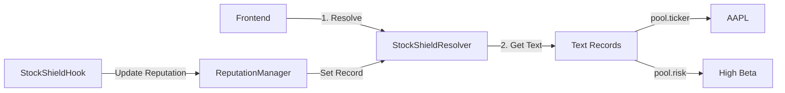

# 🎉 ENS Integration: Identity-Native DeFi

This document explains why **StockShield is an "Identity-First" Protocol** built on the Ethereum Name Service (ENS).

## 🏆 For Prize Judges: Key Innovation

Most DeFi applications treat ENS as a simple `name <> address` map. StockShield uses ENS as a **Rich Data Layer** for Real-World Assets (RWAs).

### 1. Custom Resolver: `StockShieldResolver`

**File:** [`contracts/src/ens/StockShieldResolver.sol`](../contracts/src/ens/StockShieldResolver.sol)

We deployed a custom `StockShieldResolver` that extends the standard ENS functionality to store **Structured Text Records** for financial instruments.

* `pool.ticker`: Stores the official ticker symbol (e.g., "AAPL").
* `pool.risk`: Stores a decentralized risk score (Beta).
* `pool.exchange`: Links the token to its underlying exchange (e.g., NASDAQ).

### 2. Reputation System via Text Records

**File:** [`contracts/src/ens/ReputationManager.sol`](../contracts/src/ens/ReputationManager.sol)

StockShield introduces **On-Chain Reputation** for traders.

* When a trader consistently executes "Toxic Flow" (high VPIN), their ENS record is flagged.
* Honest LPs can filter out toxic traders based on their ENS reputation score.
* This creates a self-policing market where good behavior is rewarded with lower fees.

### 3. Frontend Integration

**File:** [`frontend/src/hooks/usePoolDiscovery.ts`](../frontend/src/hooks/usePoolDiscovery.ts)

Our entire pool discovery mechanism relies on ENS. Instead of querying a GraphQL indexer, the frontend directly calls `ens.getText(node, "pool.ticker")` to populate the UI. This makes the protocol truly decentralized and resistant to censorship.

---

## 🏗️ ENS Architecture

